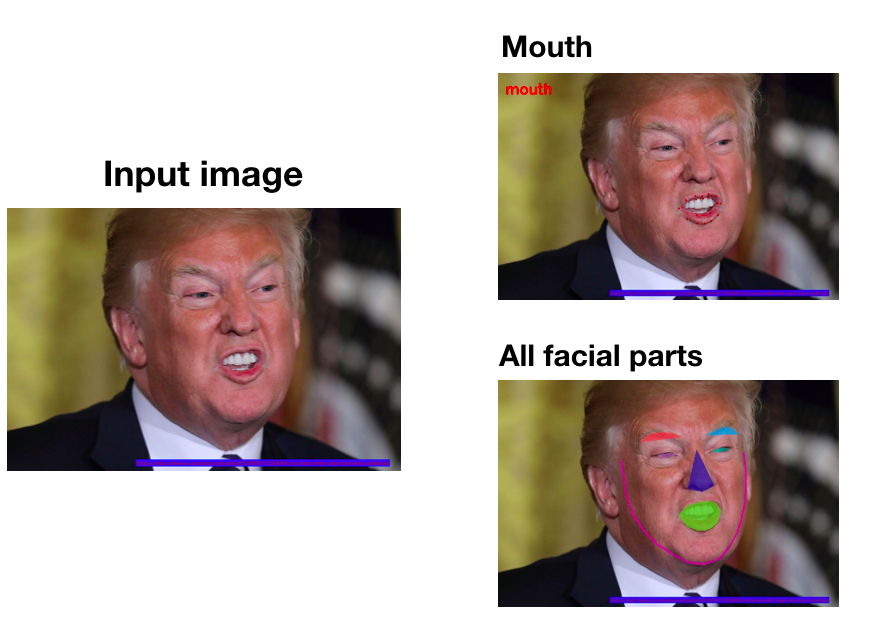

# Detect facial parts

- This module is a wrapper for facial parts recognition using opencv3 and dlib.
- Provide an input image with parts to recognize, and then it will visualize the predicted regions of facial parts from the provided image.



## Requirements

### 1. opencv3
- You need opencv3 on your machine.
- I installed opencv3 using conda. Homebrew provides opencv3; however, I didn't want to use homebrew python version. So, the following instruction assumes that you are also installing opencv3 through anaconda3.

	```
	# 1. (MUST) Create virtual environment with python3.5 and conda
	$ conda create -n opencv python==3.5.5 conda   # for example
	$ source activate opencv
	
	# 2. Install opencv3
	$ conda install -c menpo opencv3
	
	# 3. Test
	$ source activate opencv
	(opencv)$
	(opencv)$ python
	>> import cv2
	>> cv2.__version__  # e.g., '3.1.0'
	```


### 2. dlib


```
# Make sure you are under the virtual environment (e.g., 'opencv')
$ source activate opencv
(opencv)$
(opencv)$ pip install dlib
```

### 3. shape predictor model

```
$ cd model
$ . ./download_model.sh

# shape_predictor_68_face_landmarks.dat will be downloaded
```

## Test

```
python detect.py -m model/shape_predictor_68_face_landmarks.dat -i image/trump.jpg -p mouth -f -s
```

## References
- [https://www.pyimagesearch.com/2017/04/03/facial-landmarks-dlib-opencv-python/](https://www.pyimagesearch.com/2017/04/03/facial-landmarks-dlib-opencv-python/)
- [https://ibug.doc.ic.ac.uk/resources/facial-point-annotations/](https://ibug.doc.ic.ac.uk/resources/facial-point-annotations/)